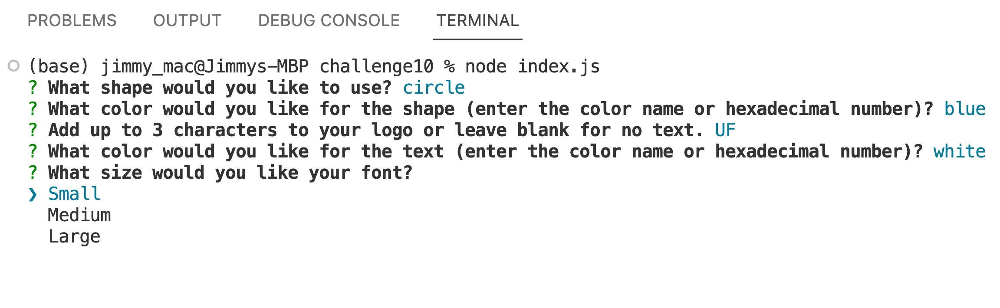
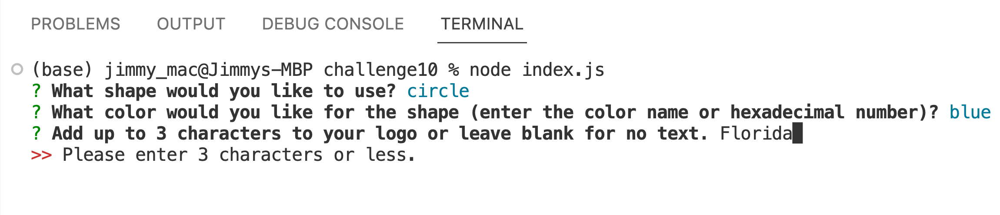
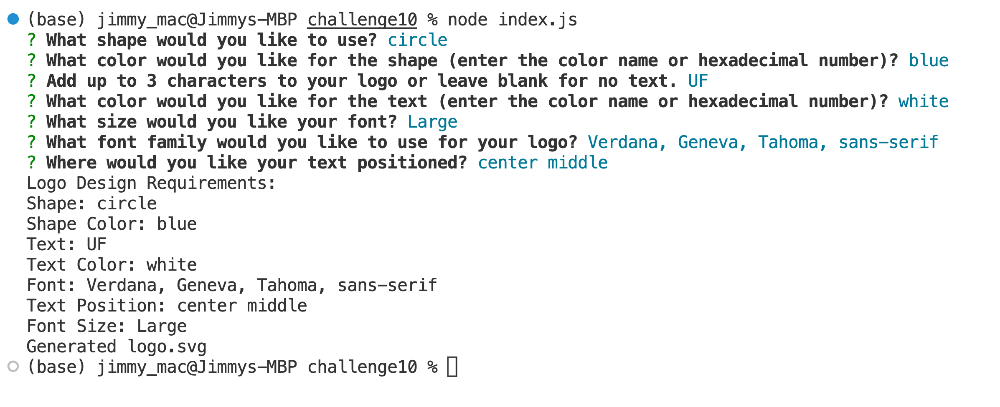
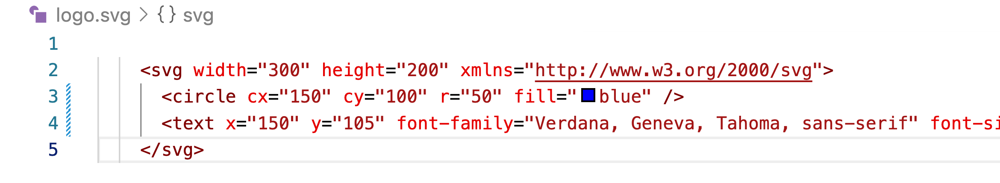
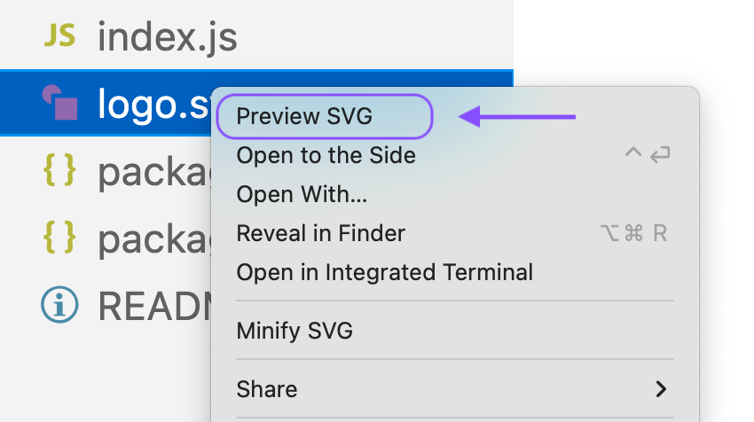

# Logo Generator

  

You can find a video of this project build [here](https://drive.google.com/file/d/1MOux1fntETVqdj3-nFhjplAMVxia9Gjm/view)

## Description
#### Motivation:
My motivation behind creating the logo generator was to streamline the logo design process and empower users to create professional looking logos without the need for advanced design skills.

#### Why Build:
By building this project, I aimed to simplify the logo design process, making it easier and more enjoyable for users to create unique and eye-catching logos for their projects.

#### Problem Solved:
The logo generator project solves the problem of creating custom logos for individuals and small businesses without the need for advanced design skills or expensive graphic design software. Many people face challenges in designing logos that effectively represent their brands and messages, either due to limited design expertise or the complexity of professional design tools.

#### What Was Learned:
Through building the logo generator project, I gained valuable insights into object-oriented programming (OOP) concepts, file system operations in Node.js, and the usage of the Inquirer.js library for interactive command-line prompts. Additionally, I learned how to implement user input validation and handle errors effectively. Working on this project also provided me with an opportunity to practice writing Jest tests to ensure the accuracy of the shape rendering functionality. Overall, the logo generator project was a valuable learning experience that deepened my understanding of web development tools and techniques.

## Table of Contents
  * [Installation](#installation)
  * [Usage](#usage)
  * [Credits](#credits)
  * [License](#license)
  * [Badges](#badges)
  * [Features](#features)
  * [Tests](#tests)

## Installation Instructions
#### Step 1:
To install the logo generator project, you'll need to have Node.js installed on your computer. If you don't have Node.js, you can download and install it from the official website (https://nodejs.org/). Once Node.js is set up, you can proceed with the logo generator installation.

#### Step 2:
First, download the project files from the source and extract them into a folder of your choice. Open a terminal or command prompt, and navigate to the folder where you extracted the project files.

#### Step 3:
Next, you need to install the project's dependencies, which include Inquirer.js and Jest. To do this, run the following command in the terminal: npm install

#### Step 4:
This command will read the package.json file and download the required packages into a node_modules folder within the project.

#### Step 5:
With the dependencies installed, you're now ready to use the logo generator. To run it, execute the following command: node index.js

## Usage
#### Example 1:
After following installation instructions and starting the file with node index.js, you will be prompted with a series of questions. Simply answer the questions to describe the logo you want designed for you. Some questions are open text prompts, while others are a dropdown. To respond to a dropdown quesition, simply use your keyboard arrow keys to place the arrow icon next to your choice and hit enter.

#### Example 2:
For text entry, you are allowed no more than three characters. If you try to type more than that you will be prompted to try again.

#### Example 3:
Once you have answered all the questions, you will see a log of all your choices. You can verify your inputs here. 

#### Example 4:
You can review the generated code for you logo by opening up the logo.svg file that was saved within your environment. 

#### Example 5:
If you would like to view your logo, you must use an svg viewer.  Once you have one, you can right click on the svg file and select "preview svg."

#### Example 6:
Once you have created your svg logo, you can move it to the examples folder and change the name to a more descriptive title. A new svg file will be saved in the original location the next time you generate a logo.

## Credits
#### Third-Party Assets:

  * I used  jestjs.io for support with jest tests. 
  
  * I used inquirer doumentation from https://www.npmjs.com/package/inquirer to support with user interface.
  
  * I used bootcamp resources to check old assignments and class work.

  * @mhenning with askBCS left me with the following code.

            
        class Square extends Shape {
          render() {
            return `stuff here`;
          }
        }
          
## License
MIT License

## Badges
  * 

## Features
  * Choose a shape between circle, square, and triangle

  * Choose any color, using the color name or the hex number.

  * select text, to include the color, size, loacation, and font type.

## Tests
  * I conducted tests to verify each shape was able to be rendered with a specified color.

## Questions 
If you have any questions about the content, instructions, or how to get involved in this project, please contact: 

  * Jimmy O'Brien    
    GitHub Username: [jimmyjr77](https://github.com/jimmyjr77/)    
    Email Address: jimmyjr.obrien@gmail.com    

